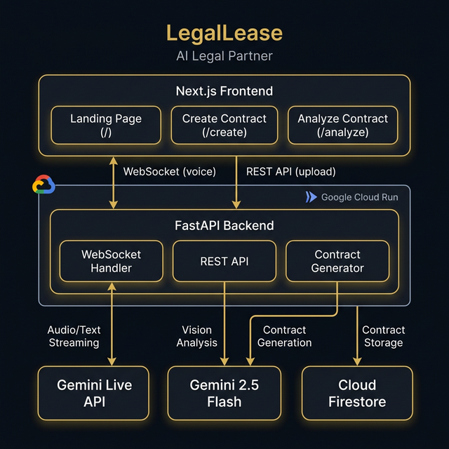

# ⚖️ LegalLease — AI Legal Partner

> **Create professional contracts through natural voice conversation, or upload existing contracts for instant AI-powered analysis.**

Built for the [Gemini Live Agent Challenge](https://geminiliveagentchallenge.devpost.com/) — Category: **Live Agents 🗣️**



---

## 🎯 Problem

Creating legal contracts is expensive, time-consuming, and inaccessible for most people. Small businesses, freelancers, and individuals often can't afford lawyers for routine agreements. Similarly, understanding the fine print in existing contracts requires legal expertise that most people don't have.

## 💡 Solution

**LegalLease** is a multimodal AI legal partner that:

1. **🎤 Creates Contracts** — Talk naturally to the AI assistant using your voice. Describe what you need, answer clarifying questions, and get a comprehensive, professionally-formatted contract generated in seconds.

2. **📄 Analyzes Contracts** — Upload a PDF or photo of any existing contract. The AI provides a detailed analysis covering risks, obligations, missing clauses, and a plain-language summary.

---

## ✨ Features

### Live Voice Agent (`/create`)

- **Real-time voice-to-voice** conversation using Gemini Live API
- **Natural interruption handling** — speak naturally, interrupt anytime
- **Supports 50+ contract types** across 5 jurisdictions
- **Auto-generates** comprehensive, legally-formatted contracts
- **Auto-saves** to Cloud Firestore

### Contract Analyzer (`/analyze`)

- **Upload PDF or image** (drag & drop or click to browse)
- **8-section structured analysis**: overview, key terms, obligations, important clauses, risks/red flags, missing elements, plain language summary, and recommendations
- **Gemini Vision** powered — reads and understands document images
- **Downloadable report** for offline reference
- **Optional context** — ask specific questions like "I'm the tenant, what should I watch out for?"

---

## 🏗️ Architecture

```
┌──────────────────────────────────────────────────┐
│              Next.js Frontend                     │
│  Landing (/) │ Create (/create) │ Analyze (/analyze) │
└──────┬──────────────┬────────────────┬───────────┘
       │              │                │
       │  WebSocket   │   REST API     │
       │  (voice)     │   (upload)     │
       ▼              ▼                ▼
┌──────────────────────────────────────────────────┐
│    Google Cloud Run — FastAPI Backend             │
│                                                   │
│  ┌───────────────┐ ┌──────────┐ ┌──────────────┐ │
│  │  WebSocket    │ │ REST API │ │  Contract    │ │
│  │  Handler      │ │          │ │  Generator   │ │
│  └───────┬───────┘ └────┬─────┘ └──────┬───────┘ │
└──────────┼──────────────┼──────────────┼─────────┘
           │              │              │
           ▼              ▼              ▼
   ┌─────────────┐ ┌───────────┐ ┌─────────────┐
   │ Gemini Live │ │  Gemini   │ │   Cloud     │
   │    API      │ │ 2.5 Flash │ │  Firestore  │
   │ (Audio I/O) │ │ (Vision)  │ │ (Storage)   │
   └─────────────┘ └───────────┘ └─────────────┘
```

### Tech Stack

| Layer               | Technology                           |
| ------------------- | ------------------------------------ |
| Frontend            | Next.js 15, React 19, TypeScript     |
| Backend             | Python 3.11, FastAPI, Uvicorn        |
| Live Agent          | Google ADK (Agent Development Kit)   |
| Contract Generation | Google GenAI SDK (standard API)      |
| Contract Analysis   | Google GenAI SDK (multimodal/vision) |
| Audio Streaming     | Gemini Live API (native audio)       |
| Database            | Cloud Firestore                      |
| Hosting             | Google Cloud Run                     |
| WebSocket           | FastAPI WebSockets + Gemini Live     |

---

## 🚀 Quick Start (Local Development)

### Prerequisites

- Python 3.11+
- Node.js 18+
- [Google Cloud CLI (`gcloud`)](https://cloud.google.com/sdk/docs/install)
- A [Gemini API key](https://aistudio.google.com/apikey)

### 1. Clone the Repository

```bash
git clone https://github.com/YOUR_USERNAME/legallease.git
cd legallease
```

### 2. Backend Setup

```bash
cd backend

# Create virtual environment
python3.11 -m venv venv
source venv/bin/activate  # macOS/Linux
# or: venv\Scripts\activate  # Windows

# Install dependencies
pip install -r requirements.txt

# Configure environment
cp .env.example .env
# Edit .env and add your GOOGLE_API_KEY
```

### 3. Firebase Setup (for contract persistence)

1. Go to [Firebase Console](https://console.firebase.google.com/)
2. Create project → Enable Firestore Database (test mode)
3. Project Settings → Service Accounts → Generate New Private Key
4. Save the JSON as `firebase-service-account.json` in the `backend/` folder
5. Update `.env`:
   ```
   FIREBASE_SERVICE_ACCOUNT_KEY=./firebase-service-account.json
   FIREBASE_PROJECT_ID=your-project-id
   ```

### 4. Start the Backend

```bash
uvicorn app.main:app --reload --host 0.0.0.0 --port 8000 --loop asyncio
```

### 5. Frontend Setup

```bash
cd ../frontend

# Install dependencies
npm install

# Configure environment
cp .env.example .env.local
# Ensure NEXT_PUBLIC_BACKEND_URL=ws://localhost:8000

# Start dev server
npm run dev
```

### 6. Open the App

Navigate to [http://localhost:3000](http://localhost:3000)

---

## 🧪 Reproducible Testing (For Judges)

Once both backend and frontend are running, follow these steps to verify the project works:

### Step 1: Verify Backend Health

```bash
curl http://localhost:8000/health
```

**Expected:** `{"status":"healthy","app":"LegalLease Live Agent","version":"2.0.0","environment":"development"}`

### Step 2: Test Contract Creation (Voice Agent)

1. Open [http://localhost:3000/create](http://localhost:3000/create)
2. Click the **microphone button** to start a voice session
3. **Allow microphone access** when prompted by your browser
4. Speak to the agent. Example prompt:
   > _"I need a sales agreement under California law. The seller is John Smith, the buyer is Sarah Johnson. It's for a 2020 Honda Civic, $15,000 paid in full on delivery, effective March 15th 2026."_
5. The agent will confirm details and ask for approval
6. Say **"Yes, that looks correct"** to confirm
7. **Expected:** A full contract appears in the right panel within 10-15 seconds
8. The contract auto-saves to Cloud Firestore

### Step 3: Test Contract Analysis (Vision)

1. Navigate to [http://localhost:3000/analyze](http://localhost:3000/analyze)
2. Upload any **PDF or image** of a contract (you can screenshot the contract from Step 2, or use any contract PDF)
3. Optionally type context like: _"I'm the buyer — what should I watch out for?"_
4. Click **"🔍 Analyze Contract"**
5. **Expected:** An 8-section structured analysis appears within 15-20 seconds, covering:
   - Contract overview
   - Key terms & definitions
   - Obligations of each party
   - Important clauses
   - Potential risks & red flags
   - Missing elements
   - Plain language summary
   - Recommendations

### Step 4: Test API Endpoints Directly (Optional)

```bash
# List all saved contracts
curl http://localhost:8000/api/contracts

# Upload a contract for analysis via CLI
curl -X POST http://localhost:8000/api/analyze \
  -F "file=@/path/to/contract.pdf" \
  -F "context=I am the tenant"
```

### Live Deployment

The backend is also deployed on Google Cloud Run:

- **Health:** [https://legallease-backend-1020043848119.us-central1.run.app/health](https://legallease-backend-1020043848119.us-central1.run.app/health)
- **API Docs:** [https://legallease-backend-1020043848119.us-central1.run.app/docs](https://legallease-backend-1020043848119.us-central1.run.app/docs)

---

## ☁️ Google Cloud Deployment

### Deploy Backend to Cloud Run

```bash
cd backend

# Authenticate
gcloud auth login
gcloud config set project YOUR_PROJECT_ID

# Deploy (automated script)
./deploy.sh

# Or manually:
gcloud builds submit --tag gcr.io/YOUR_PROJECT_ID/legallease-backend
gcloud run deploy legallease-backend \
  --image gcr.io/YOUR_PROJECT_ID/legallease-backend \
  --platform managed \
  --region us-central1 \
  --allow-unauthenticated \
  --memory 1Gi \
  --timeout 300 \
  --session-affinity
```

### Deploy Frontend to Vercel (or Cloud Run)

```bash
cd frontend

# Update .env with Cloud Run backend URL
echo "NEXT_PUBLIC_BACKEND_URL=wss://legallease-backend-XXXXX.run.app" > .env.production

# Deploy to Vercel
npx vercel --prod
```

---

## 📁 Project Structure

```
legallease/
├── backend/
│   ├── app/
│   │   ├── api/routes/
│   │   │   ├── live_agent.py      # WebSocket handler for voice agent
│   │   │   ├── analyze.py         # Contract analysis endpoint
│   │   │   ├── contracts.py       # Contract CRUD + Firestore
│   │   │   └── auth.py            # Authentication routes
│   │   ├── services/
│   │   │   ├── agent.py           # ADK agent definition + instructions
│   │   │   ├── contract_generator.py  # Contract text generation
│   │   │   └── firebase.py        # Firestore client
│   │   ├── config.py              # App configuration
│   │   └── main.py                # FastAPI application
│   ├── Dockerfile
│   ├── deploy.sh                  # Cloud Run deployment script
│   └── requirements.txt
├── frontend/
│   ├── app/
│   │   ├── page.tsx               # Landing page
│   │   ├── create/page.tsx        # Voice agent page
│   │   ├── analyze/page.tsx       # Contract analyzer page
│   │   ├── hooks/useLiveAgent.ts  # WebSocket + audio hook
│   │   └── components/
│   │       └── LiveLegalPartner.tsx
│   └── package.json
└── architecture-diagram.png
```

---

## 🔑 Google Cloud Services Used

1. **Google Cloud Run** — Hosts the FastAPI backend
2. **Cloud Firestore** — Stores generated contracts
3. **Gemini Live API** — Real-time audio streaming for voice conversation
4. **Gemini 2.5 Flash** — Contract generation and document analysis (vision)
5. **Cloud Build** — Container image building

---

## 🏆 Hackathon Category

**Live Agents 🗣️** — Real-time Interaction (Audio/Vision)

LegalLease is an agent that users can talk to naturally, with full interruption support. It uses:

- ✅ **Gemini Live API** for bidirectional audio streaming
- ✅ **Google ADK** (Agent Development Kit) for agent orchestration
- ✅ **Google Cloud** for hosting (Cloud Run + Firestore)
- ✅ **Multimodal I/O** — voice input/output + document vision analysis

---

## 📝 License

This project was built for the Gemini Live Agent Challenge hackathon.

---

_Built with ❤️ using Google Gemini, ADK, and Cloud Run_
